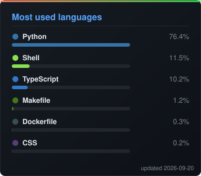
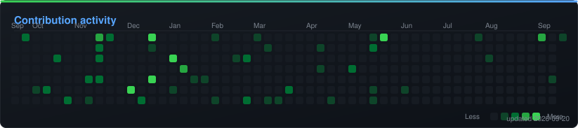
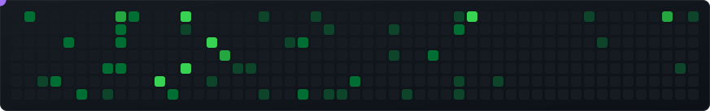

<h1 align="center">Hi, I'm Carlos Casanova</h1>
<h3 align="center">Security Engineer II @ Glovo · CTO @ Genteplus.org · Barcelona 🇪🇸</h3>

  <a href="https://carloscasanova.dev">carloscasanova.dev</a> ·
  <a href="mailto:info@carloscasanova.dev">info@carloscasanova.dev</a> ·
  <a href="https://linkedin.com/in/carlos-casanova-4703b8137">LinkedIn</a>

## About me

Systems & Security Engineer focused on IT infrastructure optimization, identity and access management (IAM) and enterprise security. I work on digital transformation and high-availability cloud environments (Azure, GCP, AWS), drive operational efficiency through automation and scripting (Python, Bash), and integrate AI tools into real corporate workflows.

What I do day to day:

- 🛡️ Harden corporate SaaS (Google Workspace, Jira, Slack) with DLP rules and CISA-aligned controls
- 🎣 Phishing analysis and incident remediation (Any.Run, SentinelOne, CultureAI)
- 🤖 Secure the corporate AI ecosystem (LiteLLM proxy, guardrails, data-protection policies)
- 🪪 Keep identity platforms highly available (OneLogin / SSO)
- ⚡ Automate operations with Python so the team stops doing repetitive work

> 📖 This profile mirrors [carloscasanova.dev](https://carloscasanova.dev) — full résumé, credentials, talks and contact live there.

## Tech stack

**☁️ Cloud & Infrastructure**

  
  
  
  
  
  
  

`VMware vSphere` `Proxmox` `Hostinger`

**🐳 Containers & DevOps**

  
  
  
  
  
  
  
  
  
  
  

**🖥️ Operating Systems**

  
  
  
  
  
  
  

`Kali` `ParrotOS`

**⌨️ Programming & Scripting**

  
  
  
  
  

`Google Apps Script`

**🔐 Security & Identity**

  

`SSO` `SAML` `OpenID` `SCIM` `ZeroTrust` `WireGuard` `OpenVPN` `Any.Run` `SentinelOne` `CultureAI` `Google SecOps`

**⚙️ Systems Administration**

  
  
  
  
  
  
  

`OneLogin` `Okta` `Google Workspace`

**🗄️ Databases & Web**

  
  
  
  
  
  
  
  
  
  
  
  
  

`Odoo` `Ghost` `RAG` `Vector DB`

**🤖 Automation**

`n8n` `Make` `Jira Automations` `AWS Lambda` `Google Cloud Functions` `Azure Functions` `GitHub Actions`

**🧠 AI Tools**

`OpenAI` `Claude` `Gemini` `VertexAI` `Google AI Studio` `LiteLLM` `Ollama` `NotebookLM` `Perplexity` `Rovo`

**🛠️ Daily driver**

  
  
  
  
  

## Stats

  
  
   
  
   
  

## Featured projects

| Project | What it is | Stack |
|---|---|---|
| [discord-bot](https://github.com/notolac/discord-bot) | Monorepo of Discord bots on the HTTP Interactions model (FastAPI endpoint + Ed25519 verification) with a shared `discord_core` library, local docs mirror and agent skills. | `Python 3.14` `uv` `FastAPI` |
| [docker-compose-portainer](https://github.com/notolac/docker-compose-portainer) | 40+ Docker Compose / Swarm stacks for self-hosting through Portainer or the CLI — generic, reusable manifests, no personal infrastructure details. | `Docker Compose` `Swarm` `Portainer` |
| [master-cybersecurity](https://github.com/notolac/master-cybersecurity) | Coursework and labs from my Master's in Cybersecurity (IMMUNE): malware analysis, ethical hacking, cryptography and security auditing. | `Python` |

## Credentials & community

- 🎓 Master's in Cybersecurity — IMMUNE Technology Institute
- 📜 AZ-104 · LPIC-1 · DevOps Tools Engineer (LPI) · CCNA · Microsoft 365 / Teams certs
- 🎙️ Talks & masterclasses on enterprise GenAI adoption (keynotes, HR masterclass, hands-on AI workshops)
- 🌱 CTO (volunteering) @ Genteplus.org — tech for migrant integration

Full list with credentials on [carloscasanova.dev](https://carloscasanova.dev).

## Contact

- 🌐 [carloscasanova.dev](https://carloscasanova.dev)
- ✉️ [info@carloscasanova.dev](mailto:info@carloscasanova.dev)
- 💼 [LinkedIn](https://linkedin.com/in/carlos-casanova-4703b8137)

---

  

